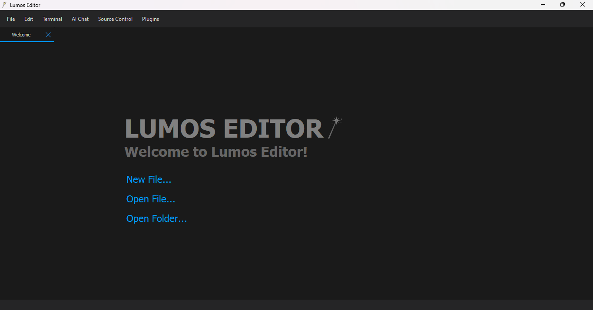

# Lumos Editor

A modern, extensible code editor built with PyQt5, featuring syntax highlighting, file tree navigation, Markdown preview, and a flexible plugin system.


 
## Features

-   **Clean, Modern UI:** A sleek dark theme designed for focus and comfort.
-   **Powerful Plugin System:** Extend the editor with custom syntax highlighters, new functionality, menu items, and event hooks.
-   **Source Control Integration:** Manage your Git repositories directly within the editor with a dedicated source control panel.
-   **AI Chat Assistant:** Get instant coding help, generate code, and ask questions with an integrated AI chat powered by Gemini.
-   **Advanced File Explorer:** Navigate your project with a file tree that supports file operations (create, rename, delete, copy, cut, paste, drag & drop).
-   **Multi-Tab Editing:** Work on multiple files simultaneously with a movable and closable tab system.
-   **Markdown Preview:** Instantly preview your Markdown files, with support for embedded images and syntax-highlighted code blocks.
-   **Media Viewer:** Open and view common image, audio, and video formats directly in the editor.
-   **Integrated Terminal:** Open a terminal in your project's root directory with a single shortcut.
 
## Installation

1.  **Clone this repository:**
    ```sh
    git clone https://github.com/memecoder12345678/lumos-editor.git
    cd lumos-editor
    ```

2.  **Install dependencies:**
    ```sh
    pip install -r requirements.txt
    ```

3.  **(Optional) Install Plugins:**
    -   Create a `plugins` folder in the root directory.
    -   Download `.lmp` files and place them inside the `plugins` folder.

4.  **(Optional) Apply Themes:**
    -   Replace the `theme.json` file in the `src` folder with your preferred code highlight theme.

5.  **Run the editor:**
    ```sh
    python lumos_editor.pyw
    ```
 
## Plugin System

Lumos Editor supports a powerful plugin system that allows for extending the editor's functionality. You can enable, disable, or manage your installed plugins via the `Plugins` menu.

> [!WARNING]
> **Security Warning:** Plugins are executed with the same permissions as the editor itself. For your security, **only install plugins from sources you trust**. Lumos Editor cannot guarantee the safety or integrity of third-party plugins.

### Plugin Concepts

Plugins are packaged as `.lmp` files (which are standard `.zip` archives). Each plugin is defined by a `manifest.json` file at its root.

#### The `manifest.json` File

This file contains metadata that describes the plugin and its capabilities.

| Field | Type | Required? | Description |
| :--- | :--- | :--- | :--- |
| **`name`** | String | Yes | The display name of the plugin. |
| **`pluginType`** | String/Array | No | Specifies the plugin's capabilities. Can be `"language"`, `"hook"`, or `"both"`. If omitted, it will be inferred. |
| **`mainFile`** | String | For `hook` plugins | The entry point script to be executed for `hook` or `both` type plugins (e.g., "main.py"). |
| **`fileExtensions`** | Array | For `language` plugins | An array of file extensions this plugin applies to (e.g., `[".js", ".mjs"]`). |
| **`iconFile`** | String | For `language` plugins | The path to the file icon within the archive (e.g., "js-icon.ico"). |
| **`lexerFile`** | String | For `language` plugins | The path to the Python script containing the lexer class. |
| **`lexerClass`** | String | For `language` plugins | The name of the custom lexer class inside `lexerFile`. |

#### Plugin Types (`pluginType`)

The `"pluginType"` field defines how Lumos Editor should treat the plugin:

-   `"language"`: The plugin provides syntax highlighting (lexer) and/or file icons.
-   `"hook"`: The plugin adds new functionality by registering hooks or adding menu items. Its `mainFile` will be executed upon loading.
-   `"both"`: The plugin combines the capabilities of both `language` and `hook` types.

If `pluginType` is omitted, the editor will infer the type: if `fileExtensions` is present, it's assumed to be a `"language"` plugin; otherwise, it's treated as a `"hook"` plugin.
 
### Hook Plugin Execution Context

For plugins of type `"hook"` or `"both"`, the specified `mainFile` is executed in a special context where several APIs and helper functions are automatically injected and available for use.

Of course. Here is the API documentation rewritten in English, following the specified style and structure where all components are accessed through the central `lumos` object.

### The Lumos API

The Lumos API provides a powerful and secure interface for integrating your plugins with the editor. All interactions are funneled through the `lumos` object, which is automatically injected into your plugin's global scope. This object serves as the single entry point for accessing all managers, helper functions, and base classes.

#### Injected API Object

-   **`lumos`**: The global `LumosAPI` instance. This is the primary object for accessing all plugin functionality. It recursively wraps and provides access to the `plugin_manager`, `config_manager`, `BaseLexer`, and all helper functions.
 
### API Components

#### `lumos.plugin_manager` API

The `plugin_manager` is the primary object for registering plugin functionality and integrating with the editor's UI.

| Method | Description |
| :--- | :--- |
| **`register_hook(event_name: str, func: callable)`** | Registers a callback function to be executed when a specific editor event occurs. The `event_name` determines when the function is called, and arguments are passed as keyword arguments (`**kwargs`). |
| **`add_menu_action(menu_name: str, text: str, callback: callable, shortcut: str = None, checkable: bool = False)`** | Adds a new clickable action to one of the main menus of the editor. `menu_name` is the name of the target menu (e.g., "File", "Tools"). |

#### `lumos.config_manager` API
The `config_manager` allows the plugin to read and write persistent settings to the editor's `config.json`.

| Method | Description |
| :--- | :--- |
| **`get(key: str, default: Any = None) -> Any`** | Retrieves a configuration value by its key. Returns `default` if the key does not exist. |
| **`set(key: str, value: Any)`** | Sets a configuration value for the specified key. |
| **`is_plugin_enabled(plugin_filename: str) -> bool`** | Checks if a specific plugin is enabled based on its filename. |
| **`set_plugin_enabled(plugin_filename: str, is_enabled: bool)`** | Enables or disables a specific plugin by its filename. |

The following configuration keys are predefined and managed internally by the `config_manager` object:

| Key | Type | Description |
| :--- | :--- | :--- |
| **`plugins_enabled`** | Boolean | Global toggle for enabling or disabling all plugins. |
| **`individual_plugins`** | Dictionary | A mapping of plugin filenames to their enabled/disabled status. |
| **`dir`** | String | The path to the currently open project directory (for terminal access). |
| **`wrap_mode`** | Boolean | Indicates whether line wrap mode is enabled in the editor. |

#### `lumos.BaseLexer` Class

-   **`BaseLexer`**: The base class for all syntax lexers used by the editor, accessed via `lumos.BaseLexer`. Plugins can subclass `BaseLexer` to define custom syntax highlighting rules, token patterns, and color schemes for new or specialized languages.

#### Helper Functions (accessed via `lumos`)

These functions provide a safe and convenient way for plugins to interact with the user and the file system within the context of the currently open project.

| Function | Description |
| :--- | :--- |
| **`get_project_dir() -> str \| None`** | Returns the absolute path of the currently open project folder. Returns `None` if no project is open. |
| **`create_project_file(relpath: str, content: str = "") -> str`** | Creates a new file (or overwrites an existing one) at `relpath` relative to the project root. Raises `RuntimeError` on failure. |
| **`write_project_file(relpath: str, content: str) -> str`** | An alias for `create_project_file`. |
| **`read_project_file(relpath: str) -> str`** | Reads and returns the content of a file at `relpath` relative to the project root. Raises `RuntimeError` on failure. |
| **`delete_project_file(relpath: str) -> bool`** | Deletes a file or directory at `relpath` relative to the project root. Raises `RuntimeError` on failure. |
| **`show_message(title: str, message: str)`** | A simple wrapper to display an informational `QMessageBox` to the user. |
| **`show_warning(title: str, message: str)`** | A simple wrapper to display a warning `QMessageBox` to the user. |
| **`show_error(title: str, message: str)`** | A simple wrapper to display an error `QMessageBox` to the user. |
| **`ask_yn_question(title: str, question: str) -> bool`** | Displays a yes/no question dialog and returns `True` if the user selects "Yes", otherwise `False`. |
| **`ask_text_input(title: str, label: str, default: str = "") -> str \| None`** | Displays a text input dialog and returns the entered string. Returns `None` if the user cancels. |
| **`get_current_file() -> str \| None`** | Returns the absolute file path of the currently active file tab. Returns `None` if no file is open or if the current tab is a new, unsaved file. |
| **`is_file() -> bool`** | Checks if the currently active tab represents a saved file on disk. Returns `True` if a saved file is active, otherwise `False`. |
| **`get_editor_text() -> str \| None`** | Gets all the text from the currently active editor tab. Returns the content as a string, or `None` if no editor is active. |
| **`set_editor_text(text: str) -> bool`** | Replaces the entire content of the active editor with the provided `text`. Returns `True` on success, `False` if no editor is active. |
| **`is_saved() -> bool`** | Checks if the active file tab has unsaved changes. Returns `True` if the file is saved or no file is active, `False` if there are unsaved modifications. |

### Packaging the Plugin

Once you have your files (`manifest.json`, `lexer.py`, `main.py`, etc.), select all of them, right-click, and compress them into a `.zip` file. **Important:** Do not zip the parent folder, only the files themselves.

Rename the final `.zip` file to have a `.lmp` extension (e.g., `my-plugin.lmp`). Drop it in the `plugins` folder and restart the editor.

## Keyboard Shortcuts

### File

| Shortcut | Action |
| :--- | :--- |
| `Ctrl+N` | New File |
| `Ctrl+O` | Open File |
| `Ctrl+K` | Open Folder |
| `Ctrl+Shift+K` | Close Folder |
| `Ctrl+S` | Save |
| `Ctrl+Shift+S` | Save As... |
| `Ctrl+R` | Restart |
| `Ctrl+Q` | Exit |

### Edit

| Shortcut | Action |
| :--- | :--- |
| `Ctrl+Z` | Undo |
| `Ctrl+Y` | Redo |
| `Ctrl+X` | Cut |
| `Ctrl+C` | Copy |
| `Ctrl+V` | Paste |
| `Ctrl+A` | Select All |
| `Ctrl+F` | Find |
| `Ctrl+H` | Replace |
| `Ctrl+W` | Toggle Wrap Mode |

### View

| Shortcut | Action |
| :--- | :--- |
| `Ctrl+B` | Toggle Explorer Panel |
| `Ctrl+P` | Toggle Markdown Preview |

### Tools

| Shortcut | Action |
| :--- | :--- |
| <code>Ctrl+Shift+`</code> | Open Terminal |
| `Ctrl+Shift+A` | Open AI Chat |
| `Ctrl+Shift+G` | Open Source Control |

### Plugins

| Shortcut | Action |
| :--- | :--- |
| `Ctrl+Shift+B` | Enable / Disable Plugins |
| `Ctrl+Shift+M` | Manage Individual Plugins... |

## Contributing

Pull requests are welcome! For major changes, please open an issue first to discuss what you would like to change.

## Credits

-   Original idea from: [https://github.com/Fus3n/pyqt-code-editor-yt](https://github.com/Fus3n/pyqt-code-editor-yt)
-   Additional inspiration from VSCode's UI/UX

## License

[MIT](https://choosealicense.com/licenses/mit/)
